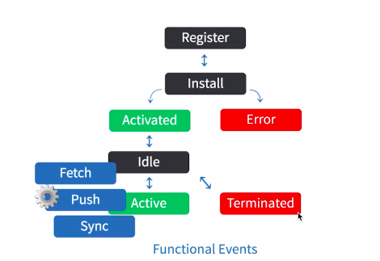

## Web应用体验依然不佳

1.网页资源下载带来的网络延迟
2.Web应用依赖浏览器作为入口
3.没有好的离线使用方案
4.没有好的消息通知方案

## PWA（Progressive Web Apps）特点
1.显著提高加载速度
2.Web应用可以在离线状态下使用
3.Web应用能够像原生应用一样被添加到主屏
4.Web应用能在未被激活时发起推送通知
5.Web应用与操作系统集成能力进一步提高

## PWA 关键技术

### Web App Manifest
通过一个清单文件向浏览器暴露web应用的元数据，包括名字、icon的URL等，以备浏览器使用，比如在添加至主屏或推送通知时暴露给操作系统，从而增强web应用与操作系统的集成能力。

W3C Web App Manifeat (manifest.json)
1.scope: 定义了web应用的浏览作用域，比如作用域外的URL就会打开浏览器而不会在当前PWA里继续浏览。
2.start_url: 定义了一个PWA的入口页面。
3.orientation: 锁定屏幕旋转
4.theme_color/background_color: 主题色与背景色，用于配置一些可定制的操作系统UI以提高用户体验，比如Android的状态栏、任务栏等
...

### Service Worker

特点:
1.可编程的Web Worker
2.像一个位于浏览器与网络之间的客户端代理，可以拦截、处理、响应流经的HTTP请求
3.配合Cache Storage API，可以自由管理HTTP请求文件粒度的缓存

Service Worker的生命周期:

Service Worker——安装

Service Worker——使用离线缓存

Service Worker——缓存策略

### Push Notification（国内还没有推送服务实现）

1.Push API的出现让推送服务具备了向web应用推送消息的能力
2.Push API不依赖web应用与浏览器UI存活，所以即使是在web应用与浏览器未被用户打开的时候，也可以通过后台进程接受推送消息并调用Notification API向用户发出通知

